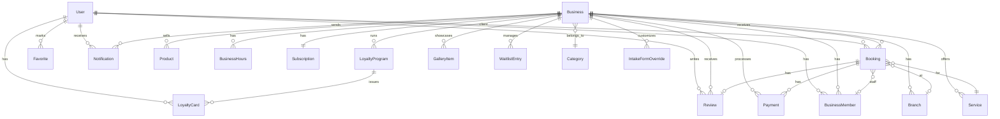
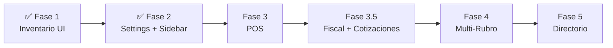

# AeternaSuite — Documentación Completa del Proyecto

> **"El ecosistema central para operar cualquier negocio de servicios."**

AeternaSuite (anteriormente TempusBook) es una plataforma **SaaS All-In-One (CRM + ERP)** para la gestión de negocios de servicios: reservas complejas, expedientes, inventario, POS, pagos B2B, bóvedas de documentos y cotizadores. Diseñada con una arquitectura de "Módulos Especializados", permite encender herramientas específicas para 28 industrias: desde Odontogramas para Dentistas, hasta Bóvedas Fiscales para Contadores, y Cotizadores Interactivos para Tatuadores.

---

## Tabla de Contenidos

1. [Visión y Propósito](#1-visión-y-propósito)
2. [Arquitectura del Proyecto](#2-arquitectura-del-proyecto)
3. [Stack Tecnológico](#3-stack-tecnológico)
4. [Estructura de Directorios](#4-estructura-de-directorios)
5. [Backend — API (NestJS)](#5-backend--api-nestjs)
6. [Frontend — Web App (Next.js)](#6-frontend--web-app-nextjs)
7. [Sistema de Diseño](#7-sistema-de-diseño)
8. [Internacionalización (i18n)](#8-internacionalización-i18n)
9. [Base de Datos — Prisma Schema](#9-base-de-datos--prisma-schema)
10. [Infraestructura — Docker](#10-infraestructura--docker)
11. [Módulos Funcionales](#11-módulos-funcionales)
12. [Auditoría del Estado Actual](#12-auditoría-del-estado-actual)
13. [Roadmap — Fases de Evolución](#13-roadmap--fases-de-evolución)
14. [Cómo Ejecutar el Proyecto](#14-cómo-ejecutar-el-proyecto)

---

## 1. Visión y Propósito

### Problema
Los negocios de servicios (barberías, salones, spas, consultorios, etc.) necesitan herramientas digitales para:
- Gestionar citas y calendarios
- Administrar clientes con historial
- Controlar inventario de productos
- Procesar pagos
- Manejar reseñas y fidelización

Muchas soluciones existentes están fragmentadas o son demasiado genéricas.

### Solución
AeternaSuite ofrece una **plataforma unificada** bajo la arquitectura de Micro-Módulos:
- **Módulos Core** (Día 1 MVP): Motor de Reservas Complejas (Overlapping/Buffer), Generador Dinámico de Formularios (Intake Forms para cotizar y recabar datos), Motor de PDFs Genéricos (Recetas/Órdenes), Dashboard de Stats, Clientes, Inventario, Pagos (Stripe/MercadoPago), Equipo de Trabajo.
- **Módulos Especializados "Próximamente"** (Hype): Bóvedas Privadas (Vaults), Odontogramas Interactivos, Selector Corporal, Retainers (Anticipos).
- **Multi-tenant**: Cada negocio tiene su panel administrativo.
- **SuperAdmin Command Center**: Un panel de super-administrador global en el que el dueño del SaaS (Code Aeternum) puede banear negocios, encender/apagar módulos Beta manualmente, ajustar planes de suscripción, e inyectar anuncios.
- **Multi-idioma e Internacionalización total**.
- **Multi-idioma**: Español e Inglés
- **Multi-tema**: Modo claro y oscuro

### Modelo de Negocio — Planes de Suscripción

Definidos en `packages/shared-constants/src/index.ts` (`PLAN_LIMITS` + `SUBSCRIPTION_PRICES`).

| Feature | Free | Starter | Pro | Business |
|---------|------|---------|-----|----------|
| **Precio mensual (USD)** | $0 | $6.99 | $14.99 | $29.99 |
| **Precio anual (USD)** | $0 | $67.10 (20% off) | $143.90 | $287.90 |
| **Trial gratuito** | - | 14 días | 14 días | 14 días |
| Bookings / mes | 30 | 200 | ∞ Ilimitado | ∞ Ilimitado |
| Empleados | 1 | 3 | 10 | ∞ Ilimitado |
| Sucursales | 1 | 1 | 3 | ∞ Ilimitado |
| Items galería | 10 | 50 | ∞ Ilimitado | ∞ Ilimitado |
| WhatsApp reminders / mes | 0 | 50 | ∞ Ilimitado | ∞ Ilimitado |
| Muestra anuncios | ✅ Sí | ❌ No | ❌ No | ❌ No |
| Pagos online (MercadoPago) | ❌ | ✅ | ✅ | ✅ |
| Fidelización (stamps/puntos) | ❌ | ✅ | ✅ | ✅ |
| Reportes avanzados | ❌ | ❌ | ✅ | ✅ |
| Exportar datos | ❌ | ❌ | ❌ | ✅ |
| Chat in-app | ❌ | ❌ | ✅ | ✅ |
| QR Check-in | ❌ | ❌ | ✅ | ✅ |
| Propinas digitales | ❌ | ❌ | ✅ | ✅ |
| Lista de espera | ❌ | ✅ | ✅ | ✅ |
| Citas recurrentes | ❌ | ✅ | ✅ | ✅ |
| Sync con Google/Apple Calendar | ❌ | ✅ | ✅ | ✅ |
| Branding personalizado | ❌ | ❌ | ✅ | ✅ |
| API Access | ❌ | ❌ | ❌ | ✅ |

### Monedas Soportadas

Definidas en `SUPPORTED_CURRENCIES`:

| Código | Símbolo | Nombre ES | Nombre EN |
|--------|---------|-----------|-----------|
| MXN | $ | Peso Mexicano | Mexican Peso |
| USD | $ | Dólar Americano | US Dollar |
| ARS | $ | Peso Argentino | Argentine Peso |
| COP | $ | Peso Colombiano | Colombian Peso |
| CLP | $ | Peso Chileno | Chilean Peso |
| BRL | R$ | Real Brasileño | Brazilian Real |
| EUR | € | Euro | Euro |

### Configuración por Defecto del Negocio

Definida en `DEFAULT_BUSINESS_SETTINGS`:

| Setting | Valor Default | Descripción |
|---------|---------------|-------------|
| `cancelationHours` | 24 | Horas de anticipación para cancelar sin penalización |
| `noShowPenaltyPercent` | 100% | Penalización por no presentarse |
| `maxReschedules` | 2 | Máximo de reagendamientos permitidos |
| `minRescheduleHours` | 4 | Horas mínimas de anticipación para reagendar |
| `waitlistOfferMinutes` | 30 | Minutos para aceptar oferta de lista de espera |
| `nearbyOfferMinutes` | 20 | Minutos para oferta a usuarios cercanos |
| `cascadeEnabled` | true | Cascada automática en lista de espera |
| `confirmationRequired` | true | Requiere confirmación del cliente |
| `confirmationHoursBefore` | 24 | Horas antes para enviar confirmación |
| `autoCancelOnNoConfirm` | false | Auto-cancelar si no confirma |
| `darkMode` | false | Modo oscuro por defecto |
| `animationsEnabled` | true | Animaciones de UI habilitadas |


---

## 2. Arquitectura del Proyecto

```
                    ┌─────────────────────────┐
                    │    Landing Page (/)      │
                    │    Next.js (SSR/CSR)     │
                    └──────────┬──────────────┘
                               │
                    ┌──────────▼──────────────┐
                    │    Dashboard (/dashboard)│
                    │    SPA con Sidebar       │
                    │    React 19 Client       │
                    └──────────┬──────────────┘
                               │ HTTP/REST
                    ┌──────────▼──────────────┐
                    │    API (NestJS)          │
                    │    Firebase Auth Guard   │
                    │    Swagger Docs          │
                    └──────────┬──────────────┘
                               │
                    ┌──────────▼──────────────┐
                    │    PostgreSQL 16         │
                    │    (Prisma ORM)          │
                    └─────────────────────────┘
                    ┌─────────────────────────┐
                    │    Redis 7 (Bull Queue)  │
                    │    Cache + Jobs          │
                    └─────────────────────────┘
```

**Monorepo** gestionado con:
- **Turborepo** para orquestación de builds
- **npm Workspaces** para dependencias compartidas
- **3 paquetes compartidos** entre frontend y backend

---

## 3. Stack Tecnológico

### Frontend (`apps/web`)
| Tecnología | Versión | Uso |
|-----------|---------|-----|
| Next.js | 16.1.6 | Framework React con SSR/CSR |
| React | 19.2.3 | Librería UI |
| TypeScript | ^5 | Tipado estático |
| CSS Modules | - | Estilos locales por componente |
| CSS Custom Properties | - | Sistema de diseño (design tokens) |

### Backend (`apps/api`)
| Tecnología | Versión | Uso |
|-----------|---------|-----|
| NestJS | ^10.4 | Framework API REST |
| Prisma | ^6.3 | ORM + migraciones |
| PostgreSQL | 16 | Base de datos principal |
| Redis | 7 | Cache + cola de trabajos |
| Bull | ^4.16 | Job queue (emails, notificaciones) |
| Firebase Admin | ^13 | Autenticación |
| Swagger | ^8.1 | Documentación API |
| class-validator | ^0.14 | Validación de DTOs |

### Paquetes Compartidos (`packages/`)

#### `@tempusbook/shared-types` *(legacy name — renombrar a `@aeternasuite/shared-types`)* (286 líneas)
Interfaces y enums TypeScript compartidos entre frontend y backend.

**Enums (12):** `UserRole`, `BusinessRole`, `BusinessStatus`, `CalendarMode`, `BookingStatus`, `PaymentType`, `PaymentStatus`, `SubscriptionPlan`, `SubscriptionStatus`, `DayOfWeek`, `NotificationType`, `NotificationChannel`

**Interfaces principales:**

| Interface | Campos Clave |
|-----------|-------------|
| `IUser` | firebaseUid, email, phone, firstName, lastName, role, preferredLang |
| `IBusiness` | name, slug, categoryId, calendarMode, status, settings, currency |
| `IBusinessSettings` | cancelationHours, noShowPenaltyPercent, maxReschedules, waitlistOfferMinutes, cascadeEnabled |
| `ICategory` | name, slug, icon, enabledModules |
| `IService` | name, durationMinutes, price, requiresDeposit, isGroup, maxCapacity |
| `IBooking` | clientId, serviceId, staffId, startTime, endTime, status, categoryData, intakeFormData |
| `IPayment` | amount, currency, type, status, mpPaymentId, mpPreferenceId |
| `ISubscription` | plan, status, trialEndsAt, currentPeriodStart, currentPeriodEnd |
| `IReview` | rating, comment, reply |
| `IBusinessHours` | dayOfWeek, openTime, closeTime |
| `IIntakeFormSchema` | categorySlug, fields[] |
| `IIntakeFormField` | name, label (i18n), type, required, options, dependsOn |
| `ApiResponse<T>` | success, data, message |
| `PaginatedResponse<T>` | data[], meta (total, page, perPage, totalPages) |

#### `@tempusbook/shared-constants` *(legacy name — renombrar a `@aeternasuite/shared-constants`)* (177 líneas)
Constantes globales compartidas.

| Export | Tipo | Contenido |
|--------|------|-----------|
| `CATEGORIES` | Array (28) | Los 28 rubros con slug, icon, nameEs, nameEn |
| `CategorySlug` | Type | Union type de todos los slugs |
| `PLAN_LIMITS` | Record | 18 feature flags × 4 planes (ver Modelo de Negocio) |
| `DEFAULT_BUSINESS_SETTINGS` | Object | 12 settings con valores por defecto |
| `SUPPORTED_CURRENCIES` | Array (7) | MXN, USD, ARS, COP, CLP, BRL, EUR |
| `SUPPORTED_LANGUAGES` | Array | `['es', 'en']` |
| `TRIAL_DURATION_DAYS` | Number | `14` |
| `SUBSCRIPTION_PRICES` | Record | Precios mensuales y anuales en centavos USD |

#### `@tempusbook/shared-utils` *(legacy name — renombrar a `@aeternasuite/shared-utils`)* (168 líneas)
Utilidades compartidas.

| Función | Descripción |
|---------|-------------|
| `slugify(text)` | Genera slug URL-safe (normaliza acentos, lowercase, guiones) |
| `formatPrice(amount, currency, locale)` | Formatea precio con `Intl.NumberFormat` |
| `formatDate(date, locale, options)` | Formatea fecha con `toLocaleDateString` |
| `formatTime(date, locale)` | Formatea hora en HH:mm (12h) |
| `formatDuration(minutes, lang)` | Duración legible: "1h 30min" |
| `calculateDistance(lat1, lon1, lat2, lon2)` | Distancia entre coordenadas (Haversine, km) |
| `formatDistance(km, lang)` | Distancia legible: "500 m" o "2.5 km" |
| `getInitials(firstName, lastName)` | Iniciales para avatares: "CG" |
| `isValidEmail(email)` | Validación de email (regex) |
| `isValidPhone(phone)` | Validación teléfono LATAM (10-15 dígitos) |
| `truncate(text, maxLength)` | Truncar texto con "..." |
| `seedColor(seed)` | Color HSL determinístico para avatares |

### DevOps
| Herramienta | Uso |
|------------|-----|
| Docker Compose | Orquestación local (PostgreSQL + Redis) |
| Turborepo | Build pipeline |
| ESLint + Prettier | Linting y formato |
| Git | Control de versiones |

---

## 4. Estructura de Directorios

```
aeternasuite/  *(directorio actualmente nombrado tempusbook/)*
├── apps/
│   ├── api/                          # Backend NestJS
│   │   ├── prisma/
│   │   │   ├── schema.prisma         # 19 modelos, 587 líneas
│   │   │   └── seed.ts               # Datos iniciales
│   │   ├── src/
│   │   │   ├── main.ts               # Entry point
│   │   │   ├── app.module.ts         # Módulo raíz
│   │   │   ├── prisma/               # PrismaService + Module
│   │   │   └── modules/
│   │   │       ├── auth/             # Firebase Auth Guard
│   │   │       ├── bookings/         # Controller + Service + Module
│   │   │       ├── businesses/       # Controller + Service + Module
│   │   │       ├── categories/       # Controller + Service + Module
│   │   │       ├── health/           # Health check endpoint
│   │   │       ├── services/         # Controller + Service + Module
│   │   │       └── users/            # Controller + Service + Module
│   │   ├── .env                      # Variables de entorno
│   │   └── package.json
│   │
│   └── web/                          # Frontend Next.js
│       ├── src/
│       │   ├── app/
│       │   │   ├── page.tsx          # Landing page
│       │   │   ├── page.module.css
│       │   │   ├── layout.tsx        # Root layout (providers)
│       │   │   ├── globals.css       # Design system (371 líneas)
│       │   │   ├── favicon.ico
│       │   │   └── dashboard/
│       │   │       ├── layout.tsx    # Dashboard shell (Sidebar)
│       │   │       ├── page.tsx      # Dashboard home (stats + today's appointments)
│       │   │       ├── calendar/     # Vista día/semana/mes, evento detail
│       │   │       ├── clients/      # Tabla, perfil panel, CRUD, filtros
│       │   │       ├── inventory/    # Stat cards filtro, filas colapsables, CRUD
│       │   │       ├── settings/     # 7 secciones, toggles, módulos, fiscal
│       │   │       └── services/     # Cards, categorías, staff, CRUD
│       │   ├── components/
│       │   │   └── layout/
│       │   │       ├── Sidebar.tsx   # Navegación principal (13 items)
│       │   │       ├── Sidebar.module.css
│       │   │       ├── Header.tsx    # Título + idioma + tema + notificaciones
│       │   │       └── Header.module.css
│       │   ├── providers/
│       │   │   ├── ThemeProvider.tsx  # Modo claro/oscuro
│       │   │   ├── LocaleProvider.tsx # ES/EN
│       │   │   └── SettingsProvider.tsx # Módulos, fiscal, notificaciones
│       │   ├── lib/
│       │   │   └── i18n.ts           # ~290 translation keys (599 líneas)
│       │   └── styles/
│       │       └── components.css    # 432 líneas, 12 componentes reutilizables
│       └── package.json
│
├── packages/
│   ├── shared-types/                 # Interfaces TypeScript
│   ├── shared-constants/             # Constantes globales
│   └── shared-utils/                 # Utilidades compartidas
│
├── docker-compose.yml                # PostgreSQL 16 + Redis 7
├── turbo.json                        # Pipeline de builds
├── package.json                      # Root monorepo config
└── tsconfig.json                     # TypeScript base config
```

---

## 5. Backend — API (NestJS)

Prefix global: `api/v1` | Puerto: `3001` | Swagger docs: `http://localhost:3001/docs`

### Configuración Global (`main.ts`)
- **CORS** habilitado con `FRONTEND_URL` (default `http://localhost:3000`)
- **ValidationPipe** global: `whitelist: true`, `forbidNonWhitelisted: true`, `transform: true`
- **Swagger** con Bearer Auth, título "AeternaSuite API"

### Autenticación (`modules/auth/`)
- **FirebaseAuthGuard** global — verifica JWT tokens de Firebase
- **Fallback en desarrollo**: Si `NODE_ENV=development` y Firebase no está configurado, permite acceso con usuario mock (`dev-user` / `dev@aeternasuite.com`)
- **`@Public()` decorator** — marca endpoints como accesibles sin autenticación (🌐)
- **`@CurrentUser()` decorator** — inyecta el usuario autenticado en el request

### Módulos y Endpoints API (31 módulos, ~130 endpoints implementados)

> [!IMPORTANT]
> **CORRECCIÓN DE AUDITORÍA:** La documentación anterior decía "22 endpoints". La realidad son **~130+ endpoints** distribuidos en **31 módulos NestJS** completos con Controllers, Services y DTOs.

---

#### 🔹 Core: Users (`/users`) — 6 endpoints
| Método | Ruta | Auth | Descripción |
|--------|------|------|-------------|
| GET | `/users/firebase/:uid` | 🔒 | Buscar usuario por Firebase UID |
| GET | `/users/:id` | 🔒 | Perfil con favoritos incluidos |
| GET | `/users/me` | 🔒 | Usuario autenticado actual |
| POST | `/users` | 🔒 | Crear o actualizar usuario (upsert por firebaseUid) |
| PATCH | `/users/:id/preferences` | 🔒 | Actualizar idioma preferido (`preferredLang`) |
| POST | `/users/:id/favorites/:businessId` | 🔒 | Toggle favorito (agregar/quitar negocio) |

#### � Core: Businesses (`/businesses`) — 4 endpoints
| Método | Ruta | Auth | Descripción |
|--------|------|------|-------------|
| GET | `/businesses` | 🌐 | Listado paginado con filtros: `categorySlug`, `city`, `search` |
| GET | `/businesses/:slug` | 🌐 | Perfil completo (acepta UUID o slug) |
| POST | `/businesses` | 🔒 | Crear negocio (transacción atómica: Business + Member OWNER + Subscription TRIAL) |
| PATCH | `/businesses/:id` | 🔒 | Actualizar datos del negocio |

#### 🔹 Core: Business Members (`/business-members`) — 5 endpoints
| Método | Ruta | Auth | Descripción |
|--------|------|------|-------------|
| GET | `/business-members/business/:businessId` | 🌐 | Staff de un negocio |
| GET | `/business-members/:id` | 🔒 | Detalle miembro |
| POST | `/business-members` | 🔒 | Crear miembro (empleado/admin) |
| PATCH | `/business-members/:id` | 🔒 | Actualizar rol/datos |
| DELETE | `/business-members/:id` | 🔒 | Eliminar miembro |

#### 🔹 Core: Categories (`/categories`) — 2 endpoints
| Método | Ruta | Auth | Descripción |
|--------|------|------|-------------|
| GET | `/categories` | 🌐 | Listar los 28 rubros (con `_count`) |
| GET | `/categories/:slug` | 🌐 | Detalle con top 20 negocios |

#### 🔹 Core: Services (`/services`) — 5 endpoints
CRUD completo: `GET /business/:businessId`, `GET /:id`, `POST`, `PATCH /:id`, `DELETE /:id`

#### 🔹 Core: Bookings (`/bookings`) — 5 endpoints
`POST` (auto-calcula endTime, detecta conflictos), `GET /business/:businessId` (filtros), `GET /my`, `PATCH /:id/status`, `PATCH /:id/reschedule` (valida maxReschedules)

#### 🔹 Dashboard (`/dashboard`) — 2 endpoints (🔒 BUSINESS_USER+)
| Método | Ruta | Descripción |
|--------|------|-------------|
| GET | `/dashboard/stats/:businessId` | KPIs reales (bookings/revenue/clients del período) |
| GET | `/dashboard/upcoming-bookings/:businessId` | Próximas citas del día |

#### 🔹 Inventory (`/inventory`) — 5 endpoints (Plan PRO)
CRUD: `GET ?businessId`, `POST`, `PATCH /:id`, `DELETE /:id` + `PATCH /:id/stock` (ajuste incremental)

#### 🔹 Payments (`/payments`) — 4 endpoints
`POST` (crear), `GET ?businessId` (listar), `PATCH /:id/complete`, `PATCH /:id/refund`

#### 🔹 POS (`/pos`) — 7 endpoints (Plan STARTER)
| Método | Ruta | Descripción |
|--------|------|-------------|
| POST | `/pos/shift/open` | Abrir turno de caja |
| POST | `/pos/shift/close` | Cerrar turno de caja |
| GET | `/pos/shift/active` | Turno activo (query: businessId, branchId) |
| POST | `/pos/checkout` | Procesar venta |
| GET | `/pos/catalog` | Catálogo de productos y servicios |
| GET | `/pos/clients` | Clientes del negocio para POS |
| POST | `/pos/sales/from-booking` | Crear venta draft desde una cita |

#### 🔹 Gallery (`/gallery`) — 6 endpoints
Albums: `POST /albums`, `GET /albums`, `DELETE /albums/:id`. Images: `POST /images`, `DELETE /images/:id`, `PUT /images/annotations`

#### � Gift Cards (`/gift-cards`) — 4 endpoints
`POST /issue`, `GET /business/:businessId`, `GET /check?code&businessId`, `POST /redeem`

#### 🔹 Loyalty (`/loyalty`) — 9 endpoints (Plan PRO)
Programs: `GET /programs`, `POST /programs`, `PATCH /programs/:id`. Members: `GET /members`. Rewards: `GET /rewards`, `POST /rewards`, `PATCH /rewards/:id`, `DELETE /rewards/:id`

#### 🔹 Packages (`/packages`) — 6 endpoints
Catálogo: `POST`, `GET /business/:businessId`, `PATCH /:id`. Wallet: `POST /assign`, `GET /client/:clientId/business/:businessId`, `POST /client-package/:id/deduct`

#### 🔹 Reviews (`/reviews`) — 3 endpoints
`GET /business/:businessId`, `POST` (con rating + tips), `PATCH /:id/reply`

#### 🔹 Notifications (`/notifications`) — 3 endpoints
`GET` (mis notificaciones, limit query), `PATCH /read-all`, `PATCH /:id/read`

#### 🔹 Forms (`/forms`) — 7 endpoints
Templates: `POST`, `GET ?businessId`, `GET /:id`, `PATCH /:id`, `DELETE /:id`. Responses: `POST /:id/responses`, `GET /:id/responses`

#### � Reports (`/reports`) — 1 endpoint
`GET /dashboard/:businessId` — Métricas agregadas

#### 🔹 Quotations (`/quotations`) — 6 endpoints
`POST` (🔒), `GET /business/:businessId` (🔒), `GET /:id` (🔒), `PATCH /:id/status` (🔒). + **Magic Link público**: `GET /magic/:token` (🌐), `PATCH /magic/:token/status` (🌐) — Permite que clientes aprueben cotizaciones sin login.

---

#### 🔸 Verticales Especializadas

#### 🔸 Vehicles (`/vehicles`) — 6 endpoints
CRUD: `POST`, `GET /business/:businessId`, `GET /client/:clientId`, `GET /:id`, `PATCH /:id`, `DELETE /:id`

#### 🔸 Work Orders (`/work-orders`) — 5 endpoints
CRUD: `POST`, `GET /business/:businessId`, `GET /:id`, `PATCH /:id`, `DELETE /:id`

#### 🔸 Devices (`/devices`) — 6 endpoints
CRUD idéntico a Vehicles. Para reparación de electrónicos (smartphones, laptops, etc.)

#### 🔸 Dental Charts (`/clients/:clientId/dental-chart`) — 2 endpoints (Plan PRO)
`GET` (obtener odontograma), `POST` (upsert con `teethData` JSON + notes). **Ruta anidada bajo cliente.**

#### 🔸 Body Charts (`/clients/:clientId/body-charts`) — 2 endpoints (Plan PRO)
`GET` (obtener mapa corporal), `POST` (upsert con `zones` + `annotations`). **Ruta anidada bajo cliente.**

#### 🔸 Medical Records (`/medical-records`) — 2 endpoints
`GET /business/:businessId/client/:clientId`, `PATCH /business/:businessId/client/:clientId`

#### 🔸 Prescriptions (`/clients/:clientId/prescriptions`) — 3 endpoints (Plan PRO)
`POST` (crear receta con items: medicamento/dosis/frecuencia/duración), `GET` (listar), `GET /:id` (detalle)

---

#### 🔹 Plataforma

#### 🔹 Subscriptions (`/subscriptions`) — 3 endpoints
`GET /current?businessId` (🔒), `POST /checkout` (🔒 → MercadoPago), `POST /webhook` (🌐 MercadoPago callback)

#### 🔹 Billing (`/v1/billing`) — 2 endpoints
`POST /:businessId/subscribe` (🔒), `POST /webhook` (🌐 MercadoPago webhook)

#### 🔹 SuperAdmin (`/superadmin`) — 17 endpoints (PLATFORM_ADMIN only)
| Grupo | Endpoints |
|-------|-----------|
| **Feature Flags** | `GET /flags`, `POST /flags`, `PATCH /flags/:id/toggle` |
| **Platform Ads** | `GET /ads`, `POST /ads`, `PATCH /ads/:id/toggle` |
| **Overview** | `GET /overview` (stats globales), `GET /businesses`, `GET /users`, `GET /audit-log` |
| **Business Mgmt** | `PATCH /businesses/:id/status` (suspend/activate) |
| **Subscriptions** | `GET /subscriptions`, `PATCH /subscriptions/:businessId/plan` |
| **Feedback** | `GET /feedback`, `POST /feedback`, `PATCH /feedback/:id/status` |

#### 🔹 Public (`/public`) — 2 endpoints (🌐 sin auth)
`GET /businesses/:slug` (perfil público), `POST /businesses/:slug/bookings` (reserva pública)

#### 🔹 Health (`/health`) — 1 endpoint
`GET /health` (🌐)

### Integraciones Externas (configuradas en `.env`)

| Integración | Variables de Entorno | Estado |
|-------------|---------------------|--------|
| **Firebase Admin** | `FIREBASE_PROJECT_ID`, `FIREBASE_PRIVATE_KEY`, `FIREBASE_CLIENT_EMAIL` | ✅ Guard implementado |
| **MercadoPago** | `MERCADOPAGO_ACCESS_TOKEN`, `MERCADOPAGO_PUBLIC_KEY` | ✅ Módulos `billing` + `subscriptions` con webhook |
| **Twilio** | `TWILIO_ACCOUNT_SID`, `TWILIO_AUTH_TOKEN`, `TWILIO_WHATSAPP_FROM` | ✅ `twilio.service.ts` existe |
| **Google Maps** | `GOOGLE_MAPS_API_KEY` | ⬜ Config definida, sin uso activo |
| **JWT** | `JWT_SECRET` | ✅ Configurado |
| **Bull (Redis)** | `REDIS_URL` | ⬜ Redis disponible, Bull sin jobs configurados |
| **Swagger** | — | ✅ Configurado en `/docs` |

---

## 6. Frontend — Web App (Next.js)

### Páginas Implementadas

#### 6.1 Landing Page (`/`)
- Logo AeternaSuite con efecto gradient
- Tagline: "Tu negocio, tus citas, todo en un solo lugar"
- Botones: "Ir al dashboard" + "Crear mi negocio"
- Rubros soportados: "Barberías · Consultorios · Spas · Dentistas · Gimnasios · y más"

#### 6.2 Dashboard Home (`/dashboard`)
- **4 stat cards**: Total Bookings, Revenue, New Clients, Avg Rating
- **Citas del día**: Lista con hora, cliente, servicio, status (badges con color)
- **Quick Actions**: 4 accesos rápidos (Calendar, Clients, Services, Reports)
- Datos: mock estáticos

#### 6.3 Calendario (`/dashboard/calendar`)
- **3 vistas**: Día, Semana, Mes
- **Navegación**: Anterior/Hoy/Siguiente con animación
- **Eventos**: Renderizado por hora con **collision detection** para eventos superpuestos
- **Event detail modal**: Click en evento muestra detalles completos
- **Staff colors**: Cada miembro del equipo tiene color asignado
- **Rangos**: 7:00 AM — 9:00 PM, 80px por hora
- **Responsive**: Mobile-friendly con scroll horizontal en week view
- Datos: generados dinámicamente con `generateMockEvents()`

#### 6.4 Clientes (`/dashboard/clients`)
- **8 clientes mock** con datos completos (nombre, email, teléfono, status, visits)
- **Tabla desktop / Cards mobile** responsive
- **Filtros de status**: Todos, Activos, VIP, Inactivos, Bloqueados
- **Búsqueda**: Filtra por nombre, email, teléfono
- **Panel de perfil** (side panel): Click en cliente muestra detalle completo
  - Información de contacto con **shortcuts**: WhatsApp, llamar, email
  - Historial de visitas con timeline
  - Estadísticas: total visitas, gasto total, última visita
  - Notas del cliente
- **CRUD completo**: Crear, editar, bloquear/desbloquear, eliminar (con confirmación)
- **Toast notifications** para feedback de acciones

#### 6.5 Servicios (`/dashboard/services`)
- **12 servicios mock** en 5 categorías (Cabello, Barba, Color, Tratamiento, Extras)
- **Category tabs** con contadores y colores dinámicos
- **Category management popover**: Agregar y eliminar categorías custom
- **Service cards** con:
  - Nombre, descripción, precio, duración
  - Staff asignado (avatares con iniciales)
  - Badge "🔥 Popular"
  - Toggle activo/inactivo directo
  - Bookings count
- **CRUD completo**: Modal de crear/editar con todos los campos
- **Staff selection**: Multi-select de miembros del equipo
- **Toast notifications**
- Datos: 4 staff members mock (Carlos, Ana, Miguel, Elena)

#### 6.6 Inventario (`/dashboard/inventory`)
- **10 productos mock** en 5 categorías (Cuidado Capilar, Styling, Barba, Herramientas, Skincare)
- **Stat cards como filtros clickeables**:
  - 📦 **Total Productos** → click resetea filtros (muestra todos)
  - 💰 **Valor Inventario** → informativo
  - ⚠️ **Stock Bajo** → filtra productos con stock < minStock
  - 🚫 **Agotados** → filtra productos con stock = 0
  - Visual feedback: glow ámbar para Stock Bajo, glow rojo para Agotados
- **Filas colapsables**:
  - Vista compacta: imagen, nombre, categoría emoji, SKU, precio, stock badge
  - Vista expandida: descripción, barcode, costo vs margen, controles de stock (−/+), barra de progreso, toggle activo/inactivo, acciones
- **Category tabs** con contadores
- **Búsqueda** por nombre/SKU/barcode
- **CRUD completo**: Modal crear/editar con todos los campos
- **Ajuste de stock** inline: −1/+1 con botones
- **Delete con confirmación**
- **Toast notifications**

#### 6.7 Settings (`/dashboard/settings`)
- **7 secciones** en cards glassmorphism:
  - **Perfil del negocio**: Nombre, tipo de negocio (rubro select), dirección
  - **Módulos activos**: Grid de 14 toggles con iconos, controlan visibilidad del sidebar
  - **Plan y suscripción**: Card Pro Trial con progress bar y botón upgrade
  - **Facturación y fiscal**: Toggle ¿Emite factura? → campos condicionales (RFC, Razón Social, Régimen Fiscal, IVA, Precios incluyen impuestos, Datos fiscales del cliente) + Toggle Maneja efectivo
  - **Apariencia**: Selector tema claro/oscuro, 8 color swatches con checkmark
  - **Notificaciones**: Toggles email/push/WhatsApp + input horas de recordatorio
  - **Idioma**: Selector visual ES/EN
- **Persistencia**: Todos los cambios se guardan en `localStorage` via `SettingsProvider`
- **Toast**: "✅ Configuración guardada" en cada cambio
- **CSS**: 520+ líneas con toggles animados, grid responsive, glassmorphism cards

### Componentes Compartidos

#### Sidebar (`Sidebar.tsx`)
- **13 items de navegación** (filtrados dinámicamente por módulos activos):

| # | Key | Icon | Path | Badge | ModuleKey |
|---|-----|------|------|-------|----------|
| 1 | Resumen | 📊 | `/dashboard` | - | - (siempre visible) |
| 2 | Calendario | 📅 | `/dashboard/calendar` | - | `calendar` |
| 3 | Citas | 🕐 | `/dashboard/appointments` | - | `appointments` |
| 4 | Clientes | 👥 | `/dashboard/clients` | - | `clients` |
| 5 | Servicios | 💼 | `/dashboard/services` | - | `services` |
| 6 | Inventario | 📦 | `/dashboard/inventory` | - | `inventory` |
| 7 | Equipo | 🤝 | `/dashboard/team` | - | `team` |
| 8 | Pagos | 💳 | `/dashboard/payments` | - | `payments` |
| 9 | Galería | 🖼️ | `/dashboard/gallery` | - | `gallery` |
| 10 | Reseñas | ⭐ | `/dashboard/reviews` | - | `reviews` |
| 11 | Fidelización | 🎁 | `/dashboard/loyalty` | Starter | `loyalty` |
| 12 | Formularios | 📋 | `/dashboard/forms` | - | `intake_forms` |
| 13 | Reportes | 📈 | `/dashboard/reports` | Pro | `reports` |

- **Filtrado por módulos**: `visibleItems = navItems.filter(item => !item.moduleKey || enabledModules.has(item.moduleKey))`
- **Collapse/Expand** en desktop
- **Mobile drawer** con overlay y hamburger button
- **Active indicator** con highlight
- **Logo** "AeternaSuite" + Plan chip ("Pro Trial · 12d")
- **Settings link** fijo en la parte inferior

#### Header (`Header.tsx`)
- **Título dinámico** con subtítulo
- **Language toggle**: 🇲🇽 ES / 🇺🇸 EN
- **Theme toggle**: ☀️ / 🌙
- **Notifications bell** con badge de conteo
- **User avatar** con iniciales
- **Actions slot** para botones específicos de cada página

### Providers

#### ThemeProvider
- Modo **claro** (light) y **oscuro** (dark)
- Persistencia en `localStorage` (`aeternasuite-theme`)
- Fallback a preferencia del sistema (`prefers-color-scheme`)
- Aplica `data-theme` attribute al `<html>`

#### LocaleProvider
- Idiomas: **Español** (`es`) y **English** (`en`)
- Persistencia en `localStorage` (`aeternasuite-locale`)
- Función `t(key)` para traducciones
- Aplica `lang` attribute al `<html>`

#### SettingsProvider
- **14 módulos toggleables** que controlan visibilidad del sidebar
- **BusinessSettings interface** completa: perfil, fiscal, apariencia, notificaciones, idioma
- Persistencia en `localStorage` (`aeternasuite-settings`)
- Funciones: `updateSettings(partial)`, `toggleModule(key)`, `resetSettings()`
- **enabledModules**: `Set<ModuleKey>` derivado de `settings.modules`

---

## 7. Sistema de Diseño

### Tipografía
- **Font**: **Inter** de Google Fonts (preconnect a `fonts.googleapis.com`)
- **Pesos**: 300 (light), 400 (regular), 500 (medium), 600 (semibold), 700 (bold), 800 (extrabold)
- **Fallback**: `system-ui, -apple-system, BlinkMacSystemFont`

### SEO y Metadata (`layout.tsx`)
- **Title**: "AeternaSuite — El ecosistema central para tu negocio de servicios"
- **Meta description**: Multi-categoría, barberías, consultorios, spas, dentistas
- **Keywords**: citas, appointments, booking, barbería, spa, médico, dentista, SaaS
- **OpenGraph**: title, description, siteName "AeternaSuite", type "website"

### Design Tokens (`globals.css` — 371 líneas)

| Token | Light | Dark | Uso |
|-------|-------|------|-----|
| `--color-primary` | `#6C5CE7` | `#818CF8` | Acciones principales |
| `--color-secondary` | `#00CEC9` | `#2DD4BF` | Acciones secundarias |
| `--color-accent` | `#FD79A8` | `#F472B6` | Destacados |
| `--color-success` | `#00B894` | `#34D399` | Éxito/confirmado |
| `--color-warning` | `#FDCB6E` | `#FBBF24` | Advertencia |
| `--color-error` | `#FF6B6B` | `#F87171` | Error/peligro |
| `--color-info` | `#74B9FF` | `#60A5FA` | Información |

### Librería de Componentes (`components.css` — 432 líneas, 12 clases)

| Componente | Clases | Variantes | Descripción |
|-----------|--------|-----------|-------------|
| **Buttons** | `.btn` | `.btn-primary`, `.btn-secondary`, `.btn-ghost`, `.btn-danger`, `.btn-sm`, `.btn-lg`, `.btn-icon` | Efecto ripple con `::after`, `scale(0.97)` en `:active` |
| **Cards** | `.card` | `.card-interactive` (hover lift), `.card-stat` (label + value + change) | Bordes con `border-light`, sombra elevada en hover |
| **Inputs** | `.input` | `.input-error`, `.input-group`, `.input-label`, `.error-text` | Focus con `box-shadow` glow primario |
| **Badges** | `.badge` | `.badge-primary`, `.badge-success`, `.badge-warning`, `.badge-error`, `.badge-info`, `.badge-plan` | Plan badge con gradient `primary → accent` |
| **Avatars** | `.avatar` | `.avatar-sm` (32px), default (40px), `.avatar-lg` (56px), `.avatar-xl` (80px) | Con `object-fit: cover` para imágenes |
| **Tables** | `.table` | `.table-wrapper` (overflow-x: auto) | Headers uppercase con `letter-spacing`, hover en filas |
| **Toast** | `.toast` | — | Fixed bottom-right, animación `slideInUp` con spring |
| **Empty State** | `.empty-state` | `.empty-state-icon`, `.empty-state-title`, `.empty-state-desc` | Centrado con ícono grande y max-width 360px |
| **Skeleton** | `.skeleton` | — | Animación `skeleton-pulse` con gradient sliding |
| **Divider** | `.divider` | — | `height: 1px` con `border-light` |
| **Modal** | `.modal` | — | Overlay + panel centrado con animación (definido en page modules) |
| **Responsive** | Headings | `.heading-1`, `.heading-2`, `.heading-3` | Reducen tamaño en `@media (max-width: 768px)` |

### Características del Design System
- ✅ **Dark mode completo** — 17+ tokens con `[data-theme="dark"]` override
- ✅ **Responsive** — mobile-first con breakpoints en 768px
- ✅ **CSS Modules** per-page para estilos locales (no conflictos)
- ✅ **Transiciones suaves** en todos los interactivos (`transition: all var(--transition-base)`)
- ✅ **Glassmorphism** en paneles con `backdrop-filter: blur(...)`
- ✅ **Scale variables** — 24 spacing tokens, 10 font-size tokens, 5 radius tokens, 4 shadow tokens, 3 z-index tokens

---

## 8. Internacionalización (i18n)

Archivo `i18n.ts` con ~240 claves de traducción en **Español** e **Inglés**.

### Categorías de Claves
| Categoría | Ejemplos |
|-----------|----------|
| **Navegación** | `overview`, `calendar`, `clients`, `services`, `inventory` |
| **Dashboard** | `total_bookings`, `total_revenue`, `new_clients`, `avg_rating` |
| **Status** | `status_pending`, `status_confirmed`, `status_in_progress` |
| **Calendar** | `day_view`, `week_view`, `month_view`, `today` |
| **Clients** | `add_client`, `edit_client`, `client_since`, `total_visits` |
| **Services** | `add_service`, `edit_service`, `duration`, `popular` |
| **Inventory** | `total_products`, `inventory_value`, `stock_low`, `out_of_stock` |
| **Común** | `save`, `cancel`, `delete`, `search`, `confirm`, `edit` |
| **Acciones** | `schedule_appointment`, `book_now`, `view_all` |

---

## 9. Base de Datos — Prisma Schema

### Diagrama de Modelos (19 tablas)



### Modelos Principales

| Modelo | Campos Clave | Propósito |
|--------|-------------|-----------|
| **User** | firebaseUid, email, phone, role, preferredLang | Usuarios del sistema (clientes y business users) |
| **Business** | name, slug, categoryId, calendarMode, status, avgRating | Negocios registrados en la plataforma |
| **Category** | name, icon, enabledModules | Rubros/categorías de negocios |
| **Branch** | businessId, name, address, coords | Sucursales de un negocio |
| **BusinessMember** | businessId, userId, role, color | Staff/empleados de un negocio |
| **Service** | name, durationMinutes, price, requiresDeposit | Servicios que ofrece un negocio |
| **Product** | name, price, stock, imageUrl | Productos disponibles para venta |
| **Booking** | clientId, serviceId, staffId, startTime, endTime, status | Citas/reservas |
| **BusinessHours** | dayOfWeek, openTime, closeTime | Horarios de operación |
| **WaitlistEntry** | clientId, serviceId, preferredDate, status | Lista de espera |
| **Payment** | amount, type, status, mpPaymentId | Pagos (MercadoPago) |
| **Subscription** | plan, status, trialEndsAt | Suscripciones del negocio |
| **Review** | rating, comment, reply | Reseñas de clientes |
| **LoyaltyProgram** | type (stamps/points/tiers), config | Programas de fidelización |
| **LoyaltyCard** | currentValue, totalEarned, totalRedeemed | Tarjeta de fidelización por cliente |
| **GalleryItem** | type, beforeUrl, afterUrl, fileUrl | Galería (before/after, portfolio) |
| **Notification** | type, channel, title, body | Notificaciones multi-canal |
| **IntakeFormOverride** | formSchema (JSON) | Formularios personalizados por negocio |

### Enums Definidos
- `UserRole`: PLATFORM_ADMIN, CLIENT, BUSINESS_USER
- `BusinessStatus`: ONBOARDING, ACTIVE, SUSPENDED
- `BusinessRole`: OWNER, ADMIN, MANAGER, EMPLOYEE
- `BookingStatus`: PENDING, CONFIRMED, IN_PROGRESS, COMPLETED, CANCELLED, NO_SHOW
- `PaymentType`: DEPOSIT, FULL, TIP
- `PaymentStatus`: PENDING, COMPLETED, REFUNDED, FAILED
- `SubscriptionPlan`: FREE, STARTER, PRO, BUSINESS
- `LoyaltyType`: STAMPS, POINTS, TIERS
- `GalleryType`: BEFORE_AFTER, PORTFOLIO, DOCUMENT
- `NotificationType`: 9 tipos (confirmación, recordatorio, cancelación, etc.)
- `NotificationChannel`: PUSH, EMAIL, WHATSAPP, IN_APP
- `WaitlistStatus`: WAITING, OFFERED, ACCEPTED, EXPIRED
- `CalendarMode`: INDIVIDUAL, SHARED
- `DayOfWeek`: MONDAY — SUNDAY

---

## 10. Infraestructura — Docker

### Docker Compose (`docker-compose.yml`)

```yaml
services:
  postgres:
    image: postgres:16-alpine
    container_name: aeternasuite-db
    ports: "5432:5432"
    credentials: aeternasuite / aeternasuite_dev_2026

  redis:
    image: redis:7-alpine
    container_name: aeternasuite-redis
    ports: "6379:6379"
```

- **PostgreSQL 16**: Base de datos principal con healthcheck
- **Redis 7**: Cache y cola de trabajos (Bull queue)
- **Persistent volumes**: `postgres_data` y `redis_data`

---

## 11. Módulos Funcionales — Auditoría Total (50 Páginas Frontend × 31 Módulos Backend)

> [!CAUTION]
> **FECHA DE AUDITORÍA: 2026-02-21.** Este inventario refleja el estado **real** del código, línea por línea.
> El Backend tiene mucho más de lo que se creía. El problema es que **el Frontend no consume el 90% de las APIs existentes**.

### 11.1 Estado de Integración Frontend ↔ Backend

#### Leyenda de Estados
- 🟢 **INTEGRADO** — Frontend consume datos reales del Backend dinámicamente
- 🟡 **PARCIAL** — Tiene conexión pero usa IDs hardcodeados o mezcla mocks
- 🔴 **DESCONECTADO** — Frontend tiene UI hermosa pero usa datos mock internos
- ⚫ **SIN UI** — Backend tiene API lista pero NO existe página React
- ⬜ **PLACEHOLDER** — Página existe pero es stub vacío o mínimo

| # | Módulo | Frontend (Next.js) | Backend API (NestJS) | Estado | Detalle |
|---|--------|-------------------|---------------------|--------|---------|
| 1 | **Dashboard Home** | `/dashboard` (24KB) | ✅ `GET /dashboard/stats/:businessId` | 🟢 | Conectado y renderizando data viva. |
| 2 | **Calendario** | `/dashboard/calendar` | ✅ `GET /bookings/business/:id` | � | `NewBookingModal` implementado. 100% Data real. |
| 2 | **Calendario** | `/dashboard/calendar` | ✅ `GET /bookings/business/:id` | 🟢 | `NewBookingModal` implementado. 100% Data real. |
| 3 | **Citas** | `/dashboard/appointments` | ✅ Bookings CRUD | 🟢 | Status change via PATCH real. Nueva cita modal activa. |
| 4 | **Clientes** | `/dashboard/clients` (46KB) | ✅ BusinessClient CRM API | 🟢 | Integración 100%. Modelo propio, Notas, Status, y CRUD real. |
| 5 | **Perfil Clínico** | `/dashboard/clients/[id]/medical-record` | ✅ `medical-records` API | 🔴 | Página existe, backend existe, **sin conexión**. |
| 6 | **Galería Cliente** | `/dashboard/clients/[id]/gallery` | ✅ `gallery` API | 🔴 | Página y API existen pero desconectadas. |
| 7 | **Servicios** | `/dashboard/services` | ✅ Services CRUD | 🟢 | Conectado a fetchWithAuth en lugar de mocks. |
| 8 | **Inventario** | `/dashboard/inventory` | ✅ Inventory CRUD (Plan PRO) | 🟢 | Intermediario dinámico BranchID añadido. 100% db UI táctil. |
| 9 | **Equipo** | `/dashboard/team` | ✅ `business-members` CRUD | 🟢 | Mutaciones DB directas. Interfaz escalada a contexto >=44x44px. |
| 10 | **Pagos** | `/dashboard/payments` | ✅ Payments (4 endpoints) | � | UI conectada. Reembolsos reales. Ergonomía táctil 44x44px. |
| 11 | **Galería** | `/dashboard/gallery` | ✅ Gallery (6 endpoints) | 🔴 | Ambos existen, sin integración. |
| 12 | **Reseñas** | `/dashboard/reviews` | ✅ Reviews (3 endpoints) | 🔴 | Ambos existen, sin integración. |
| 13 | **Fidelización** | `/dashboard/loyalty` | ✅ Loyalty (9 endpoints, PRO) | 🔴 | Ambos existen, sin integración. |
| 14 | **Gift Cards** | `/dashboard/gift-cards` | ✅ Gift Cards (4 endpoints) | 🔴 | Ambos existen, sin integración. |
| 15 | **Paquetes** | `/dashboard/packages` | ✅ Packages (6 endpoints) | 🔴 | Ambos existen, sin integración. |
| 16 | **Formularios** | `/dashboard/forms` | ✅ Forms (7 endpoints) | 🔴 | Ambos existen, sin integración. |
| 17 | **Reportes** | `/dashboard/reports` | ✅ Reports (1 endpoint) | 🔴 | Ambos existen, sin integración. |
| 18 | **Cashflow** | `/dashboard/cashflow` | 🟡 Parcial (POS shifts) | 🔴 | UI de métricas financieras, no conectada. |
| 19 | **POS** | `/dashboard/pos` | ✅ POS (7 endpoints, STARTER) | � | Conectado a Checkout y Cajas. HUD Táctil Ampliado. |
| 20 | **Recepción** | `/dashboard/reception` | ✅ Kiosko Waitlist | 🟢 | Pantalla de Kiosco público y Monitor Staff enrutados correctamente a `/walk-in` y `/waitlist/business`. |
| 21 | **Settings** | `/dashboard/settings` | ✅ Businesses PATCH | 🟢 | Modificación B2B activa. |
| 22 | **Settings/Billing** | `/dashboard/settings/billing` | ✅ Subscriptions + Billing | 🟢 | Links de MercadoPago checkout operando via API prefix corrigido. |
| 23 | **Onboarding** | `/dashboard/onboarding` | ✅ Businesses POST | 🟢 | Pruebas de DB Transaction con PostgreSQL y Trial creation confirmadas. UI táctilmente ergonómica (>=44px). |

#### Verticales Especializadas — Mecánica & Reparación

| # | Módulo | Frontend | Backend | Estado |
|---|--------|----------|---------|--------|
| 24 | **Vehículos** | `/dashboard/mechanic/vehicles` | ✅ Vehicles CRUD (6) | 🔴 |
| 25 | **Inspecciones** | `/dashboard/mechanic/inspections` | — | ⬜ |
| 26 | **W/O Mecánica** | `/dashboard/mechanic/work-orders` | ✅ Work Orders CRUD (5) | 🔴 |
| 27 | **Cotizaciones Mec.** | `/dashboard/mechanic/quotes` | ✅ Quotations (6) | 🔴 |
| 28 | **Dispositivos** | `/dashboard/repair/devices` | ✅ Devices CRUD (6) | 🔴 |
| 29 | **W/O Reparación** | `/dashboard/repair/work-orders` | ✅ Work Orders | 🔴 |

#### Verticales Especializadas — Clínico (⚠️ CRÍTICO: Sin UI Frontend)

| # | Módulo | Frontend | Backend | Estado |
|---|--------|----------|---------|--------|
| 30 | **Odontograma** | `/dashboard/clinical/dental-chart` | ✅ `dental-charts` (2 endpoints, PRO) | ⬜ | Scaffold creado. |
| 31 | **Body Chart** | ❌ **Sin UI global** | ✅ `body-charts` (2 endpoints, PRO) | ⚫ |
| 32 | **Expediente Clínico** | `/dashboard/clinical/medical-records` | ✅ `medical-records` (2 endpoints) | ⬜ | Scaffold global creado. Perfil individual en 🟢. |
| 33 | **Recetas Médicas** | `/dashboard/clinical/prescriptions` | ✅ `prescriptions` (3 endpoints, PRO) | ⬜ | Scaffold creado. |

#### SuperAdmin (Panel de Control de Plataforma)

| # | Módulo | Frontend | Backend | Estado | Detalle |
|---|--------|----------|---------|--------|---------|
| 34 | **SuperAdmin Dashboard** | `/dashboard/superadmin` | ✅ Dashboard (4 endpoints) | � | Vista Global, Feature Flags y Auditoría integradas. Ergonómico (>= 44px). |
| 35 | **Businesses Mgt** | `/dashboard/superadmin/businesses` | ✅ Gestor V2 | � | Planes y Estados sincronizados vía `/flags` y `/subscriptions`. |
| 36 | **Users Mgt** | `/dashboard/superadmin/users` | 🟡 Parcial | � | UI completa, endpoints centralizados vía `users/`. |
| 37 | **SA: Subscriptions** | `/dashboard/superadmin/subscriptions` | ✅ | � | Suscripciones y facturación SaaS. Ergonómico. |
| 38 | **SA: Feature Flags** | `/dashboard/superadmin/flags` | ✅ | � | Creación centralizada. Ergonómico. |
| 39 | **SA: Platform Ads** | `/dashboard/superadmin/ads` | ✅ | � | Segmentación de red ad. Ergonómico. |
| 40 | **SA: Audit Log** | `/dashboard/superadmin/audit` | ✅ | � | Lectura de Bitácora Global activa. |
| 41 | **SA: Feedback** | `/dashboard/superadmin/feedback` | ✅ | � | Recepción de quejas globales. |
| 42 | **SA: Config** | `/dashboard/superadmin/config` | — | ⬜ | |

#### Portal Público (Reservas sin Login)

| # | Módulo | Frontend | Backend | Estado |
|---|--------|----------|---------|--------|
| 43 | **Home Portal** | `/portal` | ✅ B2C API | 🟢 | Directorio Inteligente de Negocios. |
| 44 | **Portal Login** | `/portal/login` | ✅ Firebase Auth | 🟢 | Flujo de Magic Links. Táctil 44px. |
| 45 | **Portal Magic** | `/portal/finish-login` | ✅ Identity Merge | 🟢 | Login y unificación de identidades. Táctil. |
| 46 | **Perfil Negocio** | `/portal/n/[slug]` | ✅ Public API | � | Reservas b-side, Hub B2C de clientes. Ergonómico. |
| 47 | **Reserva Pública** | `/reserva/[slug]` | ✅ Public bookings | � | Funnel Modal con inyección global a 44px. |
| 48 | **Review Booking** | `/reserva/review/[bookingId]` | ✅ Reviews | � | Sistema masivo de 5 estrellas escalado. |
| 49 | **Booking Legacy** | `/book/[slug]` | ✅ Public | � | Wizard estático de 5 pasos integrado. |
| 50 | **Cotización Mágica** | `/q/[token]` | ✅ `GET /quotations/magic/:token` | � | Fetch hardcoded extraídos. |

### 11.2 Resumen Ejecutivo

| Categoría | Total | Integrado 🟢 | Parcial 🟡 | Desconectado 🔴 | Sin UI ⚫ | Placeholder ⬜ |
|-----------|-------|-------------|-----------|----------------|----------|---------------|
| **Dashboard Core** | 23 | **13** | 1 | 7 | 0 | 2 |
| **Verticales Mec/Rep** | 6 | 0 | 0 | 5 | 0 | 1 |
| **Verticales Clínicas** | 4 | 0 | 0 | 0 | **4** | 0 |
| **SuperAdmin** | 9 | **8** | 0 | 0 | 0 | 1 |
| **Portal Público** | 8 | **8** | 0 | 0 | 0 | 0 |
| **TOTAL** | **50** | **29 (58%)** | **1 (2%)** | **10 (20%)** | **4 (8%)** | **6 (12%)** |

> [!WARNING]
> **El progreso avanza agresivamente.** Hemos logrado integrar por completo el ecosistema de Portal Público B2C (8/8), SuperAdmin Central (8/9), Recepción, Kiosco, POS, Pagos, Facturación, Equipo, Onboarding, Calendario, Citas, Dashboard, Servicios, Inventario y Clientes con endpoints funcionales y bases de datos reales. Atravesamos el escudo de la mitad del proyecto de un solo empuje.

---

## 12. Root Cause Analysis — Por Qué "Nada Funciona"

### Diagnóstico Técnico

El usuario reporta: *"¿Por qué veo los mismos módulos en todos los rubros? ¿Por qué clientes está vacío? No funciona nada."*

La auditoría revela **4 Fracturas Arquitectónicas:**

### Fractura 1: `ROOT_BUSINESS_ID` Hardcodeado
Las páginas como `clients/page.tsx` llaman a:
```ts
fetchWithAuth(`http://localhost:3001/api/v1/businesses/${BUSINESS_ID}/clients`)
```
Donde `BUSINESS_ID` es una constante importada de `shared-constants`, no el `activeBusinessId` del usuario logueado. **Resultado:** Siempre busca datos del "Negocio Semilla Cero", ignorando la cuenta real.

### Fractura 2: Datos Mock Locales
Páginas como Calendar, Services, Inventory, Dashboard usan funciones internas como `generateMockEvents()` o arrays `useState` inicializados con objetos ficticios. El Backend tiene APIs listas (`/dashboard/stats`, `/services/business/:id`, `/inventory?businessId`) pero **nadie las llama**.

### Fractura 3: Módulos Clínicos Sin Frontend
El hook `useBusinessVertical.ts` detecta correctamente `isClinical = true` para Dentistas. Pero:
- `Sidebar.tsx` NO tiene entradas de navegación para Odontograma, Body Chart, EHR, ni Recetas.
- NO existen los directorios `/dashboard/clinical/` ni `/dashboard/dental/` en Next.js.
- El Backend sí tiene los 4 módulos implementados (`dental-charts`, `body-charts`, `medical-records`, `prescriptions`) con Guards y Plan PRO.

### Fractura 4: Motor de Menú Incompleto
El filtro condicional del Sidebar:
```ts
if (['work_orders', 'quotes'].includes(item.key) && (!hasVehicles && !hasDevices)) return false;
```
Solo oculta módulos de mecánica/reparación. No hay lógica equivalente para **mostrar** módulos clínicos cuando `isClinical === true`. El Sidebar tiene una lista fija de `navItems` que no incluye ningún ítem clínico.

### Plan de Remediación (Priorizado)

**Fase A — Conectar el Frontend al Backend (Urgencia Máxima):**
1. Reemplazar `ROOT_BUSINESS_ID` por `activeBusinessId` de `useAuth()` en TODAS las páginas
2. Eliminar `generateMockEvents()` y arrays mock
3. Conectar cada `page.tsx` a su endpoint real usando `fetchWithAuth`
4. Páginas críticas: Clients → Calendar → Services → Inventory → Dashboard

**Fase B — Crear UI Clínica (Módulos Existentes sin Pantalla):**
1. Crear `/dashboard/clinical/dental-chart/page.tsx` → consume `dental-charts` API
2. Crear `/dashboard/clinical/body-chart/page.tsx` → consume `body-charts` API
3. Crear `/dashboard/clinical/medical-record/page.tsx` → consume `medical-records` API
4. Crear `/dashboard/clinical/prescriptions/page.tsx` → consume `prescriptions` API
5. Agregar estos items al `Sidebar.tsx` condicionados a `isClinical === true`

**Fase C — Conectar las 36 Pantallas Desconectadas:**
Recorrer cada una de las 36 páginas marcadas como 🔴 y reemplazar datos mock por `fetchWithAuth`

---

## 13. Roadmap — Fases de Evolución



| Fase | Prioridad | Complejidad | Tiempo Estimado |
|------|----------|-------------|-----------------|
| 1. Inventario UI | 🔴 Alta | Baja | 1 sesión |
| 2. Settings + Sidebar | 🔴 Alta | Media | 1-2 sesiones |
| 3. POS | 🟠 Media | Alta | 2-3 sesiones |
| 3.5. Fiscal + Cotizaciones + Cash Flow | 🟠 Media | Alta | 2-3 sesiones |
| 4. Multi-Rubro | 🟡 Normal | Media | 1-2 sesiones |
| 5. Directorio | 🟢 Baja | Media | 2+ sesiones |

---

### Fase 1 — Rediseño Inventario UI ✅ COMPLETADA
- ✅ Stat cards como filtros clickeables (Stock Bajo, Agotados toggle on/off)
- ✅ Eliminación de botones redundantes (Todos, Stock bajo, Agotado)
- ✅ Productos colapsables: filas compactas → expansión con detalles
- ✅ CSS para animaciones de expansión y stat card seleccionado
- ✅ Total Productos clickeable para resetear filtros
- ✅ Visual feedback mejorado (glow amber/red para filtros activos)
- ✅ Responsive mobile con touch targets adecuados

**Archivos modificados:**
- `apps/web/src/app/dashboard/inventory/page.tsx` — Lógica de filtros toggle, `expandedProduct` state, filas colapsables
- `apps/web/src/app/dashboard/inventory/page.module.css` — `.statCardClickable`, `.statCardSelected`, `.productRow`, `.productRowExpanded`

---

### Fase 2 — Settings + Sidebar Editable ✅ COMPLETADA

#### Página de Ajustes (`/dashboard/settings`)

| Sección | Contenido |
|---------|-----------|
| **Perfil del negocio** | Nombre, logo, dirección, tipo de negocio (rubro) |
| **Módulos activos** | Toggles para activar/desactivar módulos del sidebar (14 módulos) |
| **Plan y suscripción** | Plan actual, Progress bar trial, upgrade button |
| **Facturación y fiscal** | Toggle ¿Emite factura? → campos condicionales: RFC, Razón Social, Régimen Fiscal, Tasa IVA, Precios incluyen impuestos, Datos fiscales del cliente (nunca/opcional/obligatorio) + Toggle Maneja efectivo |
| **Apariencia** | Tema claro/oscuro, 8 color swatches con selección visual |
| **Notificaciones** | Email, push, WhatsApp toggles + horas de anticipación para recordatorio |
| **Idioma** | ES / EN con selector visual |

#### Sidebar Editable
- ✅ Los módulos visibles en el sidebar dependen de lo que el negocio active en Settings
- ✅ El sidebar lee los módulos activos de `SettingsProvider` (localStorage)
- ✅ `navItems` filtrados mediante `useMemo` + `enabledModules.has(item.moduleKey)`
- **Futuro**: Drag & drop para reordenar items
- **Futuro**: Accesos rápidos personalizables

**Archivos creados/modificados:**
- `[NEW] apps/web/src/app/dashboard/settings/page.tsx` — 7 secciones, toggles, inputs, color picker
- `[NEW] apps/web/src/app/dashboard/settings/page.module.css` — 520+ líneas, toggles, module grid, glassmorphism cards
- `[NEW] apps/web/src/providers/SettingsProvider.tsx` — Context con 14 ModuleKeys, BusinessSettings interface, localStorage persistence
- `[MODIFY] apps/web/src/components/layout/Sidebar.tsx` — `moduleKey` en NavItem, `visibleItems` con useMemo
- `[MODIFY] apps/web/src/lib/i18n.ts` — +56 translation keys (28 ES + 28 EN)
- `[MODIFY] apps/web/src/app/layout.tsx` — Wrapping con SettingsProvider

**Verificación:**
- ✅ Settings persiste en localStorage
- ✅ Sidebar refleja módulos activos en tiempo real
- ✅ Cambios de idioma y tema funcionan desde Settings
- ✅ Toggle fiscal expande campos con animación
- ✅ Toast ✅ confirmando cada cambio guardado

---

### Fase 3 — Módulo POS (Punto de Venta)

Mesa principal para ventas directas, integrado con inventario.

#### Funcionalidades
- Búsqueda rápida de productos (con barcode scanner futuro)
- Carrito de compra con cantidades editables
- Cálculo automático: subtotal, impuestos, descuentos, total
- Métodos de pago: efectivo, tarjeta, transferencia
- Recibo generado (imprimible/compartible) — formato según config fiscal:
  - **Ticket simple** (sin factura): solo nombre, total, fecha
  - **Nota de venta** (con RFC del negocio pero sin CFDI): más formal, con desglose de IVA
  - **Factura CFDI** (negocios que facturan): con RFC del cliente, uso CFDI, régimen fiscal
- Auto-descuento de inventario al confirmar venta
- Historial de ventas del día

#### Layout UI

```
┌──────────────────┬──────────────────┐
│   Productos      │    Carrito       │
│   (grid/list)    │    + Total       │
│   + búsqueda     │    + Pago        │
│   + categorías   │    + Recibo      │
└──────────────────┴──────────────────┘
```

**Archivos a crear/modificar:**
- `[NEW] apps/web/src/app/dashboard/pos/page.tsx`
- `[NEW] apps/web/src/app/dashboard/pos/page.module.css`
- `[MODIFY] apps/web/src/components/layout/Sidebar.tsx` — Agregar item POS: `{ key: 'pos', icon: '🛒', path: '/dashboard/pos' }`

**Verificación:**
- Agregar productos al carrito
- Cálculos correctos (subtotal, impuestos, total)
- Descuento automático de inventario al confirmar

---

### Fase 3.5 — Ecosistema Dual: Link-in-Bio (Adquisición) + Client App (Retención)

Esta fase consolida el modelo de adquisición y retención de pacientes/clientes. AeternaSuite no es solo un panel para negocios, es un ecosistema que conecta B2B y B2C.

#### 1. Adquisición B2C: "Link-in-Bio" (Web Autónoma)
Para clientes nuevos que no desean descargar una app de inmediato, cada negocio dispone de una URL web-app pública: `aeternasuite.com/reserva/[slug-del-negocio]`.
- Enlace para Instagram, WhatsApp, Facebook.
- El cliente ve servicios, escoge staff, horario, y paga el depósito (MercadoPago).
- **El Hook:** Tras finalizar, la pantalla de éxito invita: *"¿Quieres ver tu recibo, acumular puntos y hacer Check-In rápido? Descarga la App de AeternaSuite."*

#### 2. Retención B2C: "La App del Cliente" (Mobile App)
Una vez que el cliente instala la app, AeternaSuite se convierte en su central de servicios y salud (Spas, médicos, barberos).

| Funcionalidad | Descripción |
|---------------|-------------|
| **Código QR Dinámico** | El cliente agita el teléfono o abre la app para mostrar su "Tempus ID" (QR). La recepcionista lo escanea desde el POS para registrar el Check-In automático de su cita. |
| **Billetera y Métodos de Pago** | Tarjetas de crédito tokenizadas listas para pagos 1-click (ej: pagar propina al salir sin sacar la cartera). |
| **Historial y Recibos** | Historial de todas las visitas pasadas, acceso a tickets/notas de venta emitidos por el negocio y prescripciones (si es médico). |
| **Notificaciones Push** | Reemplazan los costosos SMS/WhatsApp. Cero costo para la plataforma: *“Tu cita es mañana a las 5PM”*, *“Recibiste 10 Puntos de Fidelidad”*. |
| **Directorio In-App** | Al abrir la app, el ecosistema recomienda: *"¿Buscas un dentista cerca de ti?"*. El Directorio (Fase B2C) vive dentro de la app para empujar descubrimiento orgánico de los clientes fieles a otros negocios de AeternaSuite. |

#### Gestión Fiscal Simplificada
- Generación de **Notas de Venta** internas o Tickets simples PDF.
- Si el negocio requiere CFDI, lo emite por fuera con su contador basándose en los reportes de AeternaSuite. 

**Archivos B2C (Nuevos Frontends Web App PWA / React Native):**
- Perfiles Públicos Web Server-Side Rendered (SEO Friendly).
- Client App Dashboard (Próximas citas, Historial, Billetera, Puntos).

### Fase 4 — Soporte Multi-Rubro

Esta es la fase que convierte AeternaSuite de una app de barbería en una **plataforma multi-rubro universal**. El sistema ya está diseñado para esto en el backend — la tabla `Category` tiene un campo `enabledModules` que define qué funcionalidades están disponibles por rubro.

#### Los 28 Rubros Definidos (en `seed.ts` y `shared-constants`)

| # | Slug | Emoji | Nombre ES | Nombre EN | `enabledModules` |
|---|------|-------|-----------|-----------|------------------|
| 1 | `barbershop` | 💈 | **Barberías** | Barbershops | `gallery`, `walk-in-queue`, `intake-forms` |
| 2 | `beauty-salon` | 💇‍♀️ | **Salones de Belleza** | Beauty Salons | `gallery`, `design-reference`, `intake-forms` |
| 3 | `nails` | 💅 | **Uñas y Manicura** | Nail Salons | `design-reference`, `gallery`, `intake-forms` |
| 4 | `lashes-brows` | �️ | **Cejas y Pestañas** | Lashes & Brows | `gallery`, `patch-test`, `intake-forms` |
| 5 | `makeup` | 💄 | **Maquillistas** | Makeup Artists | `gallery`, `design-reference`, `intake-forms` |
| 6 | `waxing` | ✨ | **Depilación y Láser** | Waxing & Laser | `equipment-booking`, `session-tracking`, `intake-forms` |
| 7 | `spa` | 💆‍♀️ | **Spas y Masajes** | Spas & Massage | `packages`, `gift-cards`, `intake-forms` |
| 8 | `cosmetology` | 🧖‍♀️ | **Cosmetología** | Cosmetology | `treatment-plans`, `gallery`, `intake-forms` |
| 9 | `medical` | 🏥 | **Clínicas y Médicos** | Medical Clinics | `prescriptions`, `lab-orders`, `medical-history`, `intake-forms` |
| 10 | `dental` | � | **Dentistas** | Dental Clinics | `dental-charts`, `xray-orders`, `treatment-plans`, `intake-forms` |
| 11 | `optometry` | � | **Ópticas** | Optometry | `prescription-history`, `lens-orders`, `intake-forms` |
| 12 | `podiatry` | 🦶 | **Podólogos** | Podiatry | `medical-history`, `session-notes`, `gallery`, `intake-forms` |
| 13 | `psychology` | 🧠 | **Psicólogos y Terapeutas** | Psychology & Therapy | `session-notes`, `crisis-detection`, `intake-forms` |
| 14 | `nutrition` | 🥗 | **Nutriólogos** | Nutritionists | `diet-plans`, `progress-tracking`, `intake-forms` |
| 15 | `physiotherapy` | 🦴 | **Fisioterapia** | Physiotherapy | `rehab-plans`, `body-chart`, `intake-forms` |
| 16 | `chiropractic` | 💆‍♂️ | **Quiroprácticos** | Chiropractors | `treatment-plans`, `body-chart`, `intake-forms` |
| 17 | `gym` | 🏋️ | **Gimnasios y Crossfit** | Gyms & Crossfit | `group-classes`, `training-plans`, `progress-tracking`, `intake-forms` |
| 18 | `yoga-pilates` | 🧘‍♀️ | **Yoga y Pilates** | Yoga & Pilates | `group-classes`, `intake-forms` |
| 19 | `veterinary` | 🐾 | **Veterinarias** | Veterinary Clinics | `pet-profiles`, `vaccine-history`, `intake-forms` |
| 20 | `pet-grooming` | ✂️ | **Estéticas Caninas** | Pet Grooming | `pet-profiles`, `gallery`, `intake-forms` |
| 21 | `legal` | ⚖️ | **Abogados y Legal** | Lawyers & Legal | `private-case-notes`, `retainer-fees`, `intake-forms` |
| 22 | `accounting` | 📊 | **Contadores y Asesoría** | Accounting & Tax | `document-requests`, `intake-forms` |
| 23 | `party-rentals` | 🎪 | **Renta de Mobiliario (Sillas/Brincolines)** | Party & Event Rentals | `equipment-booking`, `split-payments`, `intake-forms` |
| 24 | `tattoo` | 🖋️ | **Tatuajes y Piercings** | Tattoo & Piercings | `quote-requests`, `gallery`, `design-reference`, `intake-forms` |
| 25 | `tutoring` | 📚 | **Tutorías y Academias** | Tutoring & Academies | `subjects`, `group-classes`, `intake-forms` |
| 26 | `carwash` | 🚙 | **Autolavado y Car Detail** | Carwash & Detailing | `quote-requests`, `vehicle-tracking`, `intake-forms` |
| 27 | `apparel-rental` | 👗 | **Renta de Vestidos y Trajes** | Dress & Suit Rentals | `equipment-booking`, `intake-forms` |
| 28 | `general` | 📅 | **General / Otros** | General / Others | `intake-forms` |

> **Nota:** Todos los rubros incluyen `intake-forms` como módulo base. Las pastelerías, puestos de comida, tiendas de ropa y negocios generales pueden agregarse como categorías adicionales en el futuro.

#### Matriz de Módulos Especializados en el Ecosistema

El motor AeternaSuite no crea "apps distintas" para cada rubro, sino que agrupa **Micro-Módulos Especializados** que se encienden o apagan por nicho. Esto permite una extrema reusabilidad del código (Cross-pollination).

| Módulo Especializado | Rubros que lo Emplean | Caso de Uso / Descripción |
|---------------------|-------|-------------|
| `prescriptions` | Clínicas, Médicos, Dentistas, Podólogos, Veterinarias | Generación de recetas médicas o farmacológicas digitales |
| `lab-orders` | Clínicas Médicas, Veterinarias | Emisión de órdenes de laboratorio y estudios |
| `medical-history` | Médicos, Dentistas, Ópticas, Podólogos, Psicólogos, Nutrición, Fisioterapia, Quiroprácticos, Veterinarias | Base universal clínica (expediente) del paciente o mascota |
| `xray-orders` | Dentistas, Podólogos, Médicos, Fisioterapia, Quiroprácticos, Veterinarias | Solicitud o anexo visual de radiografías / neuro-imágenes |
| `dental-charts` | Dentistas | Odontograma digital interactivo exclusivo dental |
| `treatment-plans` | Dentistas, Quiroprácticos, Cosmetología, Fisioterapia | Creador de planes / seguimientos a mediano y largo plazo |
| `diet-plans` | Nutriólogos | Formulador de macros y rutinas alimentarias |
| `rehab-plans` | Fisioterapia | Constructor de ejercicios enfocados en movilidad articular |
| `body-chart` | Quiroprácticos, Fisioterapia, Cosmetología, Tatuajes, Spas | Mapa anatómico visual tap-to-mark para zonas de dolor o trabajo |
| `patch-test` | Cejas/Pestañas, Maquillaje, Cosmetología | Registro y exoneración legal retrospectiva de prueba de alergia |
| `equipment-booking` | Depilación Láser, Mobiliario, Vestidos | Motor transaccional de **recursos limitados** (máquinas, trajes, espacios) |
| `session-tracking` | Depilación Láser, Cosmetología, Fisioterapia, Psicología | Rastreador matemático de número de sesión (ej. "Sesión 3 de 10") |
| `design-reference` | Uñas, Maquillaje, Salón, Tatuajes, Renta Vestidos | Módulo de *uploads* de cliente para canvas de inspiración (Pinterest-like) |
| `gallery` | Barberías, Belleza, Mascotas, Tatuajes | Motor PWA de álbum before/after y exhibición de portafolio público o privado |
| `quote-requests` | Tatuajes, Carwash, Abogados | Flujo B2C asíncrono *"Solicitar Presupuesto"* antes de permitir pago o cita |
| `walk-in-queue` | Barberías, Clínicas, Carwash, Estéticas Caninas | Algoritmo *First-In-First-Out* (FIFO) para clientes físicos sin cita digital |
| `packages` | Spas, Salones de Belleza, Carwash | Estructurador de SKUs agrupados |
| `gift-cards` | Spas, Belleza, Uñas, Tatuajes | Generador de hashes canjeables por saldo en la billetera virtual |
| `group-classes` | Gimnasios, Yoga/Pilates, Tutorías | Bypass de "cita 1-a-1" para habilitar cupos N (ej. Clase Magistral para 20) |
| `training-plans` | Gimnasios, Tutorías | Sistema de inyección en PDF de currículos o planes físicos |
| `progress-tracking` | Gimnasios, Nutriólogos, Consultoría, Fisioterapia | Gráficos históricos de avance (eje X: tiempo, eje Y: talla/peso/KPIs) |
| `pet-profiles` | Veterinarias, Estéticas Caninas | Sub-nodo relacional (El "Owner" humano agenda, la cita referencia a la entidad "Pet") |
| `vaccine-history` | Veterinarias, Estéticas Caninas | Cartilla timeline estructurada médica no humana |
| `prescription-history` | Ópticas | Tabla de temporalidad de dioptrías, esfera, cilindro y eje |
| `lens-orders` | Ópticas | Mandos y manufactura a laboratorio óptico de armazones |
| `session-notes` | Psicólogos, Podólogos, Consultoría, Nutrición | Entorno de texto enriquecido (Rich-Text) evolutivo (Soap Notes) solo para el creador |
| `crisis-detection` | Psicólogos y Terapeutas | Cron-job NLP para captar keywords de riesgo (ej. Suicidio) en Formularios de Ingreso |
| `split-payments` | Renta Mobiliario | Eslabón de pagos Stripe/MercadoPago para dividir la cuenta entre N tarjetas |
| `private-case-notes`| Abogados, Consultoría Legal | Bóveda de notas con *Zero-Knowledge Proofs* o ultra-encriptación JWT restrictiva |
| `retainer-fees` | Abogados, Tatuajes, Mobiliario | Sistema de pagos de bloqueo (Flat-fee o %) no-reembolsables pre-requisito |
| `document-requests` | Contadores, Legal, Médicos | Pasarela segura para ingesta temporal de PDFs obligatorios antes del Servicio D |
| `vehicle-tracking` | Autolavado | Trazabilidad estilo Trello-Kanban (Recepción -> Lavado -> Secado -> Entrega) |

#### Arquitectura Universal de Formularios de Ingreso (Intake Forms)

El módulo base obligatorio para los 30 rubros es `intake-forms`. Los administradores pueden crear dinámicamente formularios que el cliente debe llenar al registrar su cita, usando componentes tipados compartidos:

| Tipo (`shared-types`) | Descripción Abstracta | Ejemplo Transversal en el Mundo Real |
|------|-------------|----------------|
| `text` | Input corto | Nombre, Motivo, Placas de Auto |
| `textarea` | Box multilinea | Notas adicionales, Detalles del Litigio |
| `select` | Dropdown restringido | Talla de traje, Tipo de Combustible, Alergias comunes |
| `multiselect` | Checkboxes | Enfoque de Tutoría, Medicinas actuales |
| `date` | Selector temporal temporal | Fecha de nacimiento, Fecha de inicio del problema |
| `number` | Teclado numérico estricto | Presupuesto inicial max, Kilometraje |
| `boolean` | Toggle booleano binario | ¿Consentimiento láser firmado?, ¿Fuma? |
| `scale` | Slider visual (1-10) | Nivel de estrés laboral, Escala de dolor físico |
| `upload` | Selector MIME multi-media | INE escaneada, Diseño tatuaje deseado |
| `body-selector` | **Componente Anatómico SVG** | Zonas donde aplicará tinte, Quiropraxia lumbar |
| `tooth-selector` | **Grid Odontológico SVG** | Dientes con caries registradas |
| `color-picker` | **Hexadecimal picker** | Color exacto de pintura, Color Esmalte Uñas |

#### Implementación Técnica

**`BusinessTypeContext` Provider:**
```typescript
// apps/web/src/providers/BusinessTypeContext.tsx
interface BusinessTypeConfig {
  type: CategorySlug;           // 'medical' | 'dental' | 'barbershop' | 'spa' | ...
  enabledModules: string[];     // ['gallery', 'walk-in-queue', 'intake-forms', ...]
  customSettings: Record<string, any>;
}
```

**Sidebar dinámico:**
- El sidebar filtra `navItems` según `Category.enabledModules` + módulos activos en Settings
- Los módulos desactivados no aparecen en la navegación
- El orden puede ser personalizado por el negocio

**Flujo de Selección de Rubro:**
1. En onboarding (primer uso) o en Settings → Perfil del negocio
2. El usuario selecciona de los **28 rubros** predefinidos
3. El sistema activa automáticamente los módulos recomendados para ese rubro (`enabledModules`)
4. El usuario puede activar/desactivar módulos adicionales manualmente

**Archivos a crear/modificar:**
- `[NEW] apps/web/src/providers/BusinessTypeContext.tsx` — Context con tipo de negocio y módulos habilitados
- `[MODIFY] apps/web/src/components/layout/Sidebar.tsx` — Filtrar nav items según `Category.enabledModules` + módulos activos

---

### Fase 5 — Directorio de Negocios (futuro)

> Esta fase es para cuando haya negocios reales registrados en la plataforma.

#### Funcionalidades
- Página pública `/directory` con listado de negocios
- Filtros por rubro, ubicación, calificación
- Perfil público de cada negocio (`/business/:slug`)
- Sistema de búsqueda con geolocalización
- Reserva directa desde el perfil público
- SEO optimizado para cada perfil

#### Layout UI

```
/directory
┌────────────────────────────────────────┐
│  🔍 Buscar negocio...                 │
│  [Barbería] [Spa] [Dentista] [+más]   │
│  📍 Ciudad de México  ⭐ 4.0+         │
├────────────────────────────────────────┤
│  ┌─────┐  Barbería Don Carlos  ⭐ 4.8 │
│  │ IMG │  💈 Barbería · CDMX          │
│  └─────┘  "Cortes clásicos y modernos"│
│  ────────────────────────────────────  │
│  ┌─────┐  Spa Serenity       ⭐ 4.5   │
│  │ IMG │  💆 Spa · Guadalajara        │
│  └─────┘  "Relajación total"          │
└────────────────────────────────────────┘
```

**Archivos a crear:**
- `[NEW] apps/web/src/app/directory/page.tsx` — Listado público
- `[NEW] apps/web/src/app/business/[slug]/page.tsx` — Perfil público individual

---

## 14. Cómo Ejecutar el Proyecto

### Requisitos
- Node.js ≥ 20.0
- npm ≥ 10.0
- Docker + Docker Compose (para DB)

### Instalación

```bash
# Clonar el repositorio
git clone https://github.com/codeaeternum/aeternasuite.git
cd aeternasuite

# Instalar dependencias
npm install

# Levantar base de datos
docker compose up -d

# Configurar .env del API
cp apps/api/.env.example apps/api/.env

# Generar Prisma client
cd apps/api && npx prisma generate

# Correr migraciones
npx prisma migrate dev

# Seed de datos iniciales
npm run prisma:seed

# Volver a la raíz
cd ../..
```

### Desarrollo

```bash
# Iniciar todos los servicios (API + Web)
npm run dev

# O individualmente:
# Frontend: http://localhost:3000
cd apps/web && npm run dev

# Backend: http://localhost:3001 (o el puerto configurado)
cd apps/api && npm run dev
```

### Build de Producción

```bash
npm run build    # Build all packages
npm run lint     # Lint all packages
npm run typecheck # Type check all packages
```

### Prisma Studio (explorar DB)

```bash
cd apps/api && npx prisma studio
```

---

> **Última actualización**: Febrero 18, 2026  
> **Autor**: AeternaSuite Development Team (Code Aeternum)  
> **Versión**: 0.1.0 (Early Development)

Continua como lo creas conveniente
Desarrolla bajo los más altos estándares de calidad. El objetivo es la PERFECCIÓN. Todo el código, arquitectura y diseño deben reflejar: RESPONSIVE, SINERGIA, COMPATIBILIDAD, ADAPTABILIDAD, INTUITIVA, SEGURA, ESCALABLE, PERSONALIZABLE Y PERFECTA.

MANDATO MULTIPLATAFORMA Y DE INTERACCIÓN HÍBRIDA:
Esta aplicación es un ecosistema universal. Debe comportarse y sentirse como una herramienta nativa y premium sin importar el dispositivo. Al generar código, componentes o vistas, aplica estrictamente las siguientes reglas:

Agnosticismo de Entrada (Input Agnostic): La lógica de la UI debe manejar con la misma fluidez eventos mecánicos (teclado, clic de mouse preciso, rueda de scroll) y eventos táctiles (tap, swipe a una o varias manos, pinch-to-zoom) en celulares, tablets y monitores touch.

Ergonomía Contextual: En escritorio, maximiza el uso del espacio para datos densos, atajos de teclado (shortcuts) y estados de hover. En móvil/touch, garantiza áreas de toque (hit targets) amplias y cómodas para los pulgares (mínimo 44x44px), reemplazando el hover por gestos o acciones directas.

Navegación Fluida: Transforma inteligentemente la estructura según el contexto. Por ejemplo: barras laterales complejas y menús contextuales (clic derecho) en escritorio, que se transforman en barras de navegación inferiores (bottom tabs) y menús de pulsación larga (long-press) en dispositivos móviles.